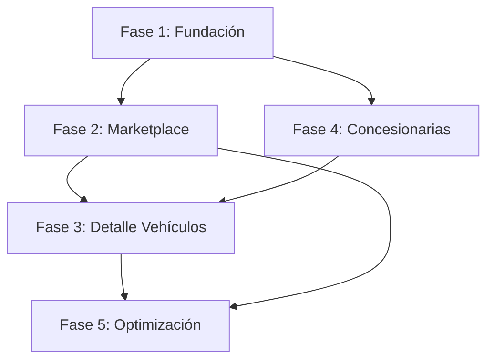

# Roadmap de Implementación Integral - Mercado de Vehículos Argentino

## Resumen Ejecutivo

Este roadmap define la estrategia completa para implementar una plataforma de mercado de vehículos usados enfocada en Argentina, integrando experiencia de usuario centrada en el contexto local con arquitectura técnica robusta y escalable.

### Objetivos Clave
- **UX Centrada en Argentina**: Interfaz en español, formato ARS, estructura geográfica local
- **Datos Reales de Producción**: Integración completa con NeonDB sin mocks ni fallbacks
- **Arquitectura Modular**: Componentes reutilizables basados en shadcn/ui existente
- **Performance Optimizada**: Carga rápida, SEO, y experiencia mobile-first

### Entregables Principales
1. **Dashboard de Marketplace** (`/marketplace`) con filtros avanzados
2. **Páginas de Detalle de Vehículos** (`/vehiculos/[id]`) con galería e información completa
3. **Directorio de Concesionarias** (`/concesionarias`) con perfiles detallados
4. **Sistema de Filtros Inteligente** con persistencia en URL
5. **Integración de Contacto** con WhatsApp, teléfono y formularios

---

## Fase 1: Fundación y Componentes Base
**Duración**: Semana 1 | **Prioridad**: Crítica

### Objetivos de la Fase
Establecer la infraestructura técnica y los componentes fundamentales que soportarán toda la aplicación.

### 1.1 Configuración de Base del Sistema
**Estimado**: 1-2 días

#### Tareas Técnicas
- [ ] **Actualizar `app/layout.tsx`**
  - Configurar `lang="es"` para español
  - Integrar meta tags específicos de Argentina
  - Configurar theme provider para modo claro/oscuro
  - Establecer estructura de navegación base

- [ ] **Crear sistema de internacionalización**
  - `lib/translations.ts` - Diccionario completo en español argentino
  - Términos específicos del dominio automotriz
  - Formatos locales (fechas, números, moneda)

- [ ] **Configurar utilidades de formato**
  - `lib/format-utils.ts` - Formateo de precios ARS
  - Funciones de formateo de números con separadores
  - Helpers de fecha en formato DD/MM/AAAA
  - Constructores de URLs de WhatsApp

#### Entregables UX
- [ ] **Sistema de design tokens**
  - Paleta de colores argentina (azul primario #0066CC, celeste #87CEEB)
  - Escalado tipográfico responsivo
  - Espaciado y breakpoints definidos

- [ ] **Accesibilidad base**
  - Contraste WCAG 2.1 AA compliant
  - Aria labels en español
  - Keyboard navigation setup

### 1.2 Componentes de Layout Core
**Estimado**: 2-3 días

#### Componentes Críticos
- [ ] **`components/layout/Header.tsx`**
  - Logo y navegación principal
  - Búsqueda rápida integrada
  - Menú hamburguesa para móvil
  - Links a `/marketplace` y `/concesionarias`

- [ ] **`components/layout/Footer.tsx`**
  - Información de la empresa
  - Enlaces legales y contacto
  - Redes sociales (si aplica)
  - Copyright y branding

- [ ] **`components/common/SearchBar.tsx`**
  - Búsqueda por marca, modelo, o texto libre
  - Autocompletado con datos de NeonDB
  - Navegación directa a resultados filtrados

#### Validaciones UX
- [ ] Responsive design en móvil, tablet, desktop
- [ ] Touch targets de mínimo 44px en móvil
- [ ] Navegación intuitiva y consistente
- [ ] Estados de hover y focus claramente visibles

### 1.3 Extensión de Queries de Base de Datos
**Estimado**: 2 días

#### Nuevos Archivos de Queries
- [ ] **`lib/vehicle-queries.ts`**
  - `searchVehicles()` - Búsqueda con filtros múltiples
  - `getVehicleDetails()` - Detalle completo con joins
  - `getFilterOptions()` - Opciones para filtros dinámicos
  - `getFeaturedVehicles()` - Vehículos destacados/oportunidades

- [ ] **Extender `lib/dealership-queries.ts`**
  - `getDealershipsWithInventory()` - Concesionarias con stock
  - `getDealershipProfile()` - Perfil completo con inventario
  - Queries optimizadas con índices apropiados

#### Optimizaciones Técnicas
- [ ] Índices de base de datos para queries de filtros
- [ ] Joins optimizados para reducir N+1 queries
- [ ] Paginación eficiente con offset/limit
- [ ] Schemas de validación con Zod

---

## Fase 2: Marketplace Dashboard Funcional
**Duración**: Semana 2 | **Prioridad**: Alta

### Objetivos de la Fase
Implementar el corazón de la aplicación: el marketplace principal con sistema de filtros y visualización de vehículos.

### 2.1 Página Principal de Marketplace
**Estimado**: 2-3 días

#### Implementación Técnica
- [ ] **`app/marketplace/page.tsx`**
  - Server-side rendering con datos iniciales
  - SEO optimizado con meta tags dinámicos
  - Breadcrumb navigation
  - Layout responsivo de 3 columnas (filtros + contenido + info)

- [ ] **`app/marketplace/loading.tsx`**
  - Skeleton screens para carga inicial
  - Progressive loading de componentes
  - Shimmer effects en tarjetas

- [ ] **Estados de error y vacío**
  - `app/marketplace/error.tsx` con recovery options
  - Empty states cuando no hay resultados
  - Mensajes de error claros en español

#### Experiencia de Usuario
- [ ] **Jerarquía visual clara**
  - Título principal "Mercado de Vehículos Usados"
  - Subtítulo con valor proposition
  - Indicadores de cantidad de resultados

- [ ] **Navegación contextual**
  - Breadcrumbs para orientación
  - Filtros aplicados visibles
  - Botón "Limpiar filtros" accesible

### 2.2 Sistema de Filtros Avanzado
**Estimado**: 3-4 días

#### Componente Principal
- [ ] **`components/vehicles/FilterPanel.tsx`**
  - **Filtro de Precio**: Slider de rango con formateo ARS
  - **Ubicación**: Dropdown cascada Provincia → Ciudad
  - **Marca/Modelo**: Combobox con búsqueda y contadores
  - **Año**: Slider de rango (1990 - presente)
  - **Kilometraje**: Input numérico con validación
  - **Oportunidades AI**: Checkbox para vehículos destacados
  - **Persistencia**: URL search params para bookmarking

#### Lógica de Estado
- [ ] **Estado de filtros con React hooks**
  - `useFilters()` custom hook para manejo de estado
  - Sincronización con URL search params
  - Debounced API calls para performance
  - Loading states durante filtrado

#### UX de Filtros
- [ ] **Responsive behavior**
  - Panel lateral persistente en desktop
  - Modal/sheet colapsible en móvil
  - Botón flotante "Filtros" en móvil
  - Contador de filtros activos

### 2.3 Visualización de Vehículos
**Estimado**: 3-4 días

#### Componentes de Vehículos
- [ ] **`components/vehicles/VehicleCard.tsx`**
  - Imagen principal con lazy loading
  - Título (Marca Modelo Año)
  - Precio en formato ARS con separadores
  - Especificaciones básicas (km, combustible)
  - Badge "Oportunidad" para AI-flagged vehicles
  - Ubicación (Ciudad, Provincia)
  - Botón CTA "Ver detalles"

- [ ] **`components/vehicles/VehicleGrid.tsx`**
  - Grid responsivo (1 col móvil, 2 tablet, 3-4 desktop)
  - Infinite scroll o paginación
  - Loading skeletons durante carga
  - Empty states con sugerencias

#### Performance y UX
- [ ] **Optimizaciones de imagen**
  - Next.js Image component con placeholders
  - Lazy loading con intersection observer
  - WebP format with fallbacks
  - Responsive image sizes

- [ ] **Microinteracciones**
  - Hover effects en cards (desktop)
  - Smooth transitions
  - Loading spinners
  - Toast notifications para acciones

### 2.4 API Routes de Búsqueda
**Estimado**: 2 días

#### Endpoints Principales
- [ ] **`app/api/vehicles/search/route.ts`**
  - GET endpoint con query parameters
  - Validación con Zod schemas
  - Filtrado dinámico con SQL WHERE clauses
  - Paginación y metadata de resultados
  - Error handling robusto

- [ ] **`app/api/filters/options/route.ts`**
  - Opciones dinámicas para filtros
  - Contadores de resultados por opción
  - Caching de opciones frecuentes
  - Actualización en tiempo real

---

## Fase 3: Páginas de Detalle de Vehículos
**Duración**: Semana 3 | **Prioridad**: Alta

### Objetivos de la Fase
Crear la experiencia completa de detalle de vehículo con galería, especificaciones y funcionalidad de contacto.

### 3.1 Página de Detalle Principal
**Estimado**: 2-3 días

#### Implementación Técnica
- [ ] **`app/vehiculos/[id]/page.tsx`**
  - Dynamic route con server-side rendering
  - Meta tags dinámicos para SEO (título, descripción, OG)
  - Structured data JSON-LD para search engines
  - Error handling para IDs inválidos (404)

- [ ] **Layout de página optimizado**
  - Grid responsivo de 2-3 columnas
  - Sidebar sticky para contacto
  - Breadcrumb navigation
  - Botón "Volver a resultados" con estado preservado

#### Datos y Performance
- [ ] **Query optimizada de vehículo**
  - Single query con todos los joins necesarios
  - Imágenes ordenadas por prioridad
  - Información completa de concesionaria
  - Caching con revalidation strategy

### 3.2 Galería de Imágenes Avanzada
**Estimado**: 2-3 días

#### Componente de Galería
- [ ] **`components/vehicles/VehicleGallery.tsx`**
  - Imagen principal grande con zoom
  - Thumbnails navegables
  - Swipe navigation en móvil
  - Keyboard navigation (arrow keys)
  - Fullscreen mode con overlay
  - Loading progressive de imágenes

#### Experiencia Visual
- [ ] **Optimizaciones UX**
  - Smooth transitions entre imágenes
  - Lazy loading de thumbnails
  - Placeholder mientras cargan
  - Error fallback para imágenes rotas
  - Indicadores de posición (1 de X)

### 3.3 Especificaciones Técnicas
**Estimado**: 1-2 días

#### Componente de Specs
- [ ] **`components/vehicles/VehicleSpecs.tsx`**
  - Grid responsivo de especificaciones
  - Iconos descriptivos para cada categoría
  - Formateo apropiado de valores
  - Secciones colapsibles en móvil
  - Destacado de features importantes

#### Información Mostrada
- [ ] **Datos técnicos formateados**
  - Año, kilometraje, motor, potencia
  - Combustible, transmisión, color
  - Estado del vehículo
  - Características adicionales
  - VIN (si disponible)

### 3.4 Sistema de Contacto con Concesionaria
**Estimado**: 2-3 días

#### Componente de Contacto
- [ ] **`components/vehicles/ContactDealer.tsx`**
  - Información de concesionaria
  - Botones de acción directa:
    - WhatsApp con mensaje pre-filled
    - Llamada telefónica
    - Email directo
  - Formulario de contacto opcional
  - Horarios de atención
  - Ubicación y direcciones

#### Funcionalidad de Contacto
- [ ] **Integración con comunicación**
  - URLs de WhatsApp con mensaje contextual
  - Links `tel:` para llamadas directas
  - Formulario con validación
  - Confirmación de envío
  - Tracking de interacciones (analytics)

---

## Fase 4: Directorio de Concesionarias
**Duración**: Semana 4 | **Prioridad**: Media

### Objetivos de la Fase
Completar la funcionalidad del directorio de concesionarias con perfiles detallados y navegación por inventario.

### 4.1 Directorio Principal
**Estimado**: 2 días

#### Página de Directorio
- [ ] **`app/concesionarias/page.tsx`**
  - Lista paginada de concesionarias
  - Filtros por provincia, marca oficial, tipo
  - Ordenamiento por relevancia, nombre, ubicación
  - SEO optimizado para búsquedas locales

#### Componente de Tarjetas
- [ ] **`components/dealerships/DealerCard.tsx`**
  - Logo/imagen de concesionaria
  - Nombre y ubicación prominent
  - Marcas oficiales como badges
  - Contador de vehículos disponibles
  - Rating/reseñas si disponible
  - Información de contacto resumida

### 4.2 Perfiles de Concesionarias
**Estimado**: 2-3 días

#### Página de Perfil
- [ ] **`app/concesionarias/[id]/page.tsx`**
  - Header con información principal
  - Inventario de vehículos disponibles
  - Información de contacto completa
  - Mapa de ubicación (opcional con Leaflet/MapBox)

#### Componente de Perfil
- [ ] **`components/dealerships/DealerProfile.tsx`**
  - Información empresarial completa
  - Horarios de atención estructurados
  - Múltiples métodos de contacto
  - Galería de vehículos con filtros básicos
  - Enlaces a redes sociales

### 4.3 API Routes de Concesionarias
**Estimado**: 1-2 días

#### Endpoints Necesarios
- [ ] **`app/api/dealerships/route.ts`**
  - Lista con filtros y paginación
  - Ordenamiento múltiple
  - Contadores de inventario dinámicos

- [ ] **`app/api/dealerships/[id]/route.ts`**
  - Perfil completo con inventario
  - Estadísticas de la concesionaria
  - Información de contacto validada

---

## Fase 5: Optimización y Refinamiento
**Duración**: Semana 5 | **Prioridad**: Media-Alta

### Objetivos de la Fase
Pulir la experiencia, optimizar performance y preparar para producción.

### 5.1 Testing Integral
**Estimado**: 2-3 días

#### Testing Técnico
- [ ] **Unit tests**
  - Utilities (format-utils, translations)
  - Schemas de validación
  - Custom hooks

- [ ] **Integration tests**
  - API routes con datos de prueba
  - Componentes con contexto real
  - Flujos completos de usuario

- [ ] **E2E tests**
  - Búsqueda y filtrado
  - Navegación detalle → contacto
  - Responsive behavior

#### Testing UX
- [ ] **Usability testing**
  - Tareas específicas en dispositivos reales
  - Tiempo de completado de tareas
  - Rate de errores y confusión
  - Feedback qualitativo de usuarios

### 5.2 Optimización de Performance
**Estimado**: 2 días

#### Web Performance
- [ ] **Core Web Vitals**
  - LCP < 2.5s (optimización de imágenes)
  - FID < 100ms (code splitting)
  - CLS < 0.1 (reserved spaces)

- [ ] **Optimizaciones específicas**
  - Image compression y format
  - Database query optimization
  - Component code splitting
  - Critical CSS inlining

#### Database Performance
- [ ] **Query optimization**
  - Índices adicionales si necesarios
  - Query explain análisis
  - Caching de queries frecuentes
  - Connection pooling verification

### 5.3 SEO y Accesibilidad Final
**Estimado**: 1-2 días

#### SEO Enhancement
- [ ] **Meta tags dinámicos**
  - Títulos únicos por página
  - Descripciones contextuales
  - OpenGraph para social sharing
  - Twitter Card metadata

- [ ] **Technical SEO**
  - Sitemap.xml generation
  - Robots.txt optimization
  - Canonical URLs
  - Schema.org structured data

#### Accesibilidad Final
- [ ] **WCAG 2.1 AA compliance**
  - Screen reader testing
  - Keyboard navigation flows
  - Color contrast validation
  - Focus management

---

## Arquitectura de Dependencias

### Dependencias Críticas

### Tareas Paralelas Posibles
- **Componentes UI** pueden desarrollarse en paralelo con **API routes**
- **Testing** puede comenzar desde Fase 2
- **Optimización de imágenes** puede implementarse incrementalmente
- **SEO básico** debe implementarse desde Fase 1

---

## Métricas de Éxito

### KPIs Técnicos
- **Performance**: LCP < 2.5s, FID < 100ms
- **SEO**: Core Web Vitals en verde
- **Error Rate**: < 1% en production
- **Test Coverage**: > 80% para lógica crítica

### KPIs UX
- **Task Success Rate**: > 90% para tareas principales
- **Time to Complete**: < 2 minutos búsqueda → contacto
- **Mobile Usage**: Experiencia optimizada para 70%+ mobile traffic
- **User Satisfaction**: > 4.5/5 en feedback surveys

### KPIs de Negocio
- **Contact Rate**: % usuarios que contactan concesionarias
- **Search Success**: % búsquedas que resultan en vista de detalle
- **Return Visitors**: Engagement y retención de usuarios
- **Geographic Coverage**: Representación de todas las provincias

---

## Gestión de Riesgos

### Riesgos Técnicos
| Riesgo | Probabilidad | Impacto | Mitigación |
|--------|-------------|---------|------------|
| Performance de queries con filtros múltiples | Media | Alto | Índices optimizados, query profiling |
| Carga de imágenes lenta | Alta | Medio | CDN, lazy loading, formato WebP |
| Compatibilidad móvil | Media | Alto | Testing continuo, progressive enhancement |

### Riesgos UX
| Riesgo | Probabilidad | Impacto | Mitigación |
|--------|-------------|---------|------------|
| Filtros complejos confunden usuarios | Media | Alto | User testing temprano, iteración |
| Formularios de contacto no convertir | Alta | Medio | A/B testing, simplificación |
| Navegación no intuitiva | Media | Alto | Breadcrumbs, navegación consistente |

### Riesgos de Datos
| Riesgo | Probabilidad | Impacto | Mitigación |
|--------|-------------|---------|------------|
| Datos incompletos o inconsistentes | Alta | Medio | Validación robusta, fallbacks |
| Imágenes rotas o missing | Media | Medio | Placeholders, error handling |
| Performance con grandes datasets | Media | Alto | Paginación, caching, optimización |

---

## Plan de Despliegue

### Estrategia de Release
1. **Staging Environment**: Deploy continuo para testing
2. **Feature Flags**: Rollout gradual de funcionalidades
3. **A/B Testing**: Para elementos críticos de conversión
4. **Production Monitoring**: Tracking de errores y performance

### Rollback Plan
- **Database migrations**: Reversibles y probadas
- **Component versioning**: Rollback rápido de componentes
- **Feature toggles**: Disable features problemáticas
- **Backup strategy**: Snapshots antes de releases mayores

---

## Conclusión

Este roadmap integra la visión UX centrada en Argentina con una arquitectura técnica robusta, estableciendo un plan de implementación realista y ejecutable. La estrategia de fases permite entregar valor incrementalmente mientras construye hacia una plataforma completa y optimizada.

### Próximos Pasos Inmediatos
1. **Kick-off Fase 1**: Setup del entorno y componentes base
2. **Review de requirements**: Validación con stakeholders
3. **Setup de repositorio**: Branching strategy y CI/CD
4. **Milestone planning**: Sprints detallados para cada fase

La implementación de este roadmap resultará en una plataforma de marketplace de vehículos que no solo cumple con los requisitos técnicos, sino que también proporciona una experiencia de usuario excepcional adaptada específicamente al mercado argentino.