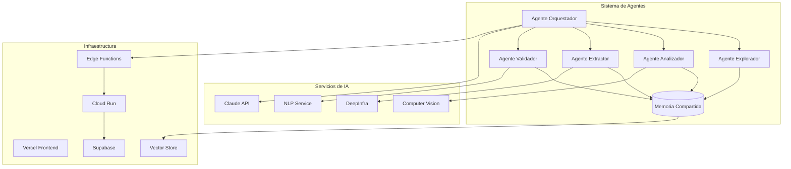
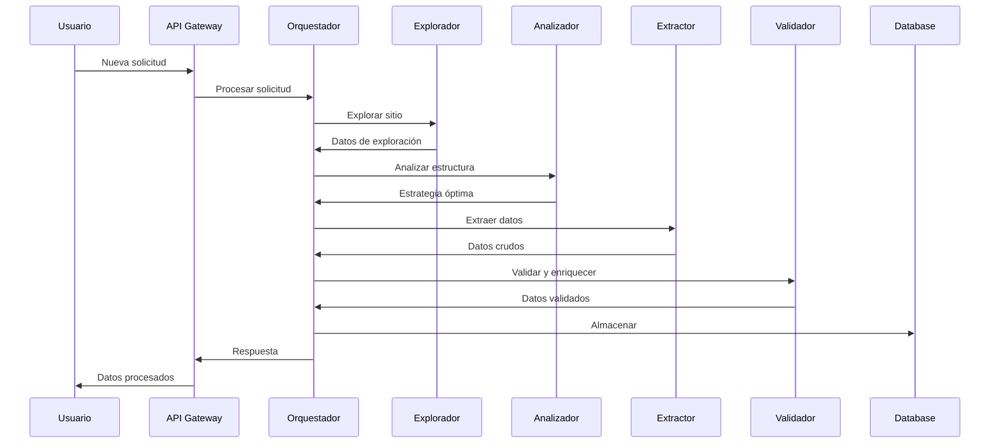

# 🏗️ Arquitectura del Sistema

## Diseño Basado en Agentes Autónomos

### 🌟 Paradigma de Agentes IA

Garage AI implementa una arquitectura revolucionaria basada en **agentes autónomos de inteligencia artificial** que trabajan de forma coordinada pero independiente. Cada agente tiene responsabilidades específicas y capacidades de aprendizaje continuo.



### 🔄 Flujo de Trabajo Inteligente

#### 1. **Descubrimiento Automático**
```typescript
// El sistema descubre nuevas fuentes automáticamente
const discoveryFlow = {
  trigger: 'scheduled_or_manual',
  steps: [
    'scan_known_sources',
    'discover_new_sources',
    'validate_accessibility',
    'queue_for_analysis'
  ]
};
```

#### 2. **Análisis Adaptativo**
```typescript
// Análisis inteligente de estructura
const analysisFlow = {
  visual: 'computer_vision_analysis',
  semantic: 'content_understanding',
  structural: 'dom_pattern_recognition',
  historical: 'past_patterns_comparison'
};
```

#### 3. **Extracción Semántica**
```typescript
// Extracción basada en comprensión
const extractionFlow = {
  strategy: 'multi_modal',
  fallbacks: ['visual', 'semantic', 'pattern'],
  validation: 'real_time',
  enrichment: 'ai_powered'
};
```

### 🧠 Componentes Principales

#### **1. Núcleo de Orquestación**

```typescript
class OrchestrationCore {
  private agents: Map<string, BaseAgent>;
  private memory: SharedMemory;
  private queue: JobQueue;
  
  async processRequest(request: ScrapingRequest) {
    // Análisis de solicitud
    const strategy = await this.determineStrategy(request);
    
    // Asignación de agentes
    const pipeline = this.createPipeline(strategy);
    
    // Ejecución coordinada
    return await this.executePipeline(pipeline, request);
  }
}
```

#### **2. Sistema de Memoria**

```typescript
class SharedMemory {
  private vectorStore: VectorDatabase;
  private cache: RedisCache;
  private patterns: PatternRegistry;
  
  async learn(experience: Experience) {
    // Almacenar en vector DB
    const embedding = await this.embed(experience);
    await this.vectorStore.insert(embedding);
    
    // Actualizar patrones
    await this.patterns.update(experience.patterns);
  }
  
  async recall(context: Context) {
    // Buscar experiencias similares
    const similar = await this.vectorStore.search(context);
    return this.rankByRelevance(similar, context);
  }
}
```

#### **3. Motor de Adaptación**

```typescript
class AdaptationEngine {
  async adapt(failure: FailureEvent) {
    // Analizar causa del fallo
    const analysis = await this.analyzeFailure(failure);
    
    // Generar nueva estrategia
    const newStrategy = await this.generateStrategy(analysis);
    
    // Validar y aplicar
    if (await this.validateStrategy(newStrategy)) {
      await this.applyStrategy(newStrategy);
    }
  }
}
```

### 🏛️ Arquitectura de Microservicios

#### **Frontend (Vercel)**
- Next.js 15 con App Router
- Edge Runtime para máximo rendimiento
- UI Components con Tailwind + shadcn/ui
- Real-time updates con Server-Sent Events

#### **API Layer (Edge Functions)**
- Orquestación de agentes
- Rate limiting inteligente
- Caché distribuido
- WebSocket support

#### **Processing Layer (Cloud Run)**
- Agentes containerizados
- Auto-scaling horizontal
- GPU support para CV/ML
- Batch processing

#### **Data Layer (Supabase + Pinecone)**
- PostgreSQL para datos estructurados
- Vector DB para patrones y embeddings
- Real-time subscriptions
- Row Level Security

### 🔐 Seguridad y Confiabilidad

#### **Capas de Seguridad**
1. **API Gateway**: Rate limiting y autenticación
2. **Service Mesh**: Comunicación segura entre servicios
3. **Data Encryption**: En tránsito y en reposo
4. **Audit Logging**: Trazabilidad completa

#### **Resiliencia**
- Circuit breakers en cada servicio
- Retry logic con backoff exponencial
- Fallback strategies
- Health checks continuos

### 📊 Monitoreo y Observabilidad

```typescript
class SystemMonitor {
  metrics = {
    agentPerformance: new MetricCollector('agent_performance'),
    extractionSuccess: new MetricCollector('extraction_success'),
    adaptationRate: new MetricCollector('adaptation_rate'),
    dataQuality: new MetricCollector('data_quality')
  };
  
  async checkHealth() {
    const health = {
      agents: await this.checkAgents(),
      services: await this.checkServices(),
      data: await this.checkDataIntegrity()
    };
    return this.aggregateHealth(health);
  }
}
```

### 🚀 Ventajas de la Arquitectura

1. **Autonomía**: Los agentes trabajan independientemente
2. **Escalabilidad**: Cada componente escala según demanda
3. **Adaptabilidad**: Aprende y mejora continuamente
4. **Resiliencia**: Tolerante a fallos con múltiples fallbacks
5. **Eficiencia**: Optimización automática de recursos

### 🔄 Ciclo de Vida de una Solicitud



---

*Siguiente: [Agentes de IA →](./02-agentes-ia.md)*